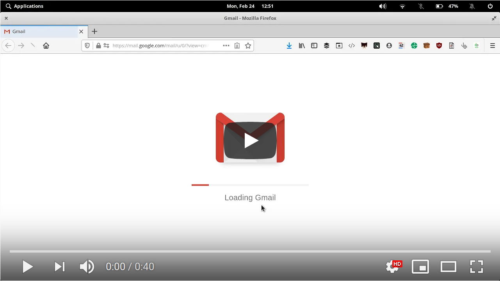

# Mail Merge helper for Linux

This package was created by and is maintained by [Peter Thaleikis](https://peterthaleikis.com). It provides a simple helper to replicate popular mail merge services. You can use a CSV file to populate content using a template and trigger `mailto` actions on your preferred browser. If you'd like to contribute, please see [CONTRIBUTING](CONTRIBUTING.md) for details. You can read more about the [mail merge project](https://peterthaleikis.com/posts/mail-merge-for-linux/) on my blog.

<a href="https://www.youtube.com/watch?v=jLvmbJDe0ys" rel="nofollow" target="_blank"></a>

## Installation

```bash
git clone git@github.com:spekulatius/linux-bash-mail-merge.git
```

## Requirements

The project itself doesn't have any direct dependencies. Your system will need to fulfill some basic requirements though:

- Linux with bash. I've not tried any other approaches, but there is a chance it works on systems of similar nature (e.g. MacOS).

- x-www-browser to be set to your browser. You can adjust this using the command `sudo update-alternatives --config x-www-browser`

- A browser supporting `mailto:`-URLs being executed and directed to your email provider. [Firefox](https://getfirefox.com) 73 does this by default.

- PHP 7.2 or newer. This will be raised as PHP versions go out of support.


## Usage

1. Fill in your CSV file and name it `targets.csv`. You should always have at least the following headers: `Subject` and `Email` as the script uses these.
2. Write your template file and name it `template.txt`. Within the template file you can use any headers defined in the CSV file. The subject line should always be the first line and can start with `Subject:` (optional). Please note that you should write all headers in capital letters. So, `Email` would be transformed to `EMAIL` automatically.
3. Run `php generate.php` to trigger the merge of the content and the related `mailto:` commands. You might need to allow these actions to be triggering your provider email (e.g. Gmail). You can test this by clicking this link: [mailto:test@test.com](mailto:test@test.com).


## Troubleshooting

If you have placeholders in your template which aren't replaced with content from the CSV file, it might break the email being generated properly. Always ensure all placeholders exist in the CSV file.


## Support

You can support my open source work and the development through [Buy me a coffee](https://www.buymeacoffee.com/spekulatius). Social shares are also appreciated. If you'd like to get informed about major changes and other new projects you can subscribe to [my newsletter](https://peterthaleikis.com/newsletter/).

## License

The mail merge package is open-source software and licensed under the [MPL-2.0](LICENSE.md) license.
